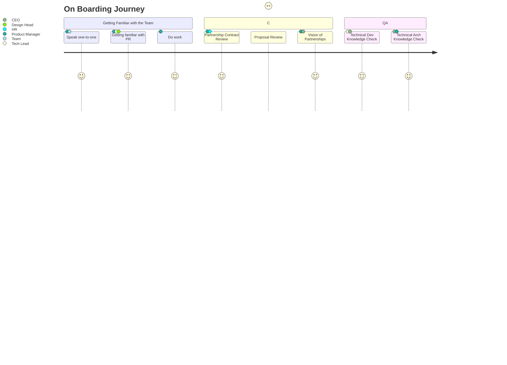

## Overview

### Technical Checklist

- [ ] cloudflare - how it works
- [ ] netlify - how it works
- [ ] aws/lambda - how it works
- [ ] next js framework
- [ ] nest js framework
- [ ] golden crown admin panel
- [ ] github fundamental course 

`Last Edit : 18 May` 
