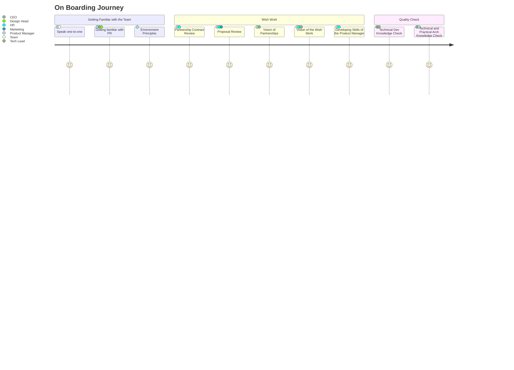
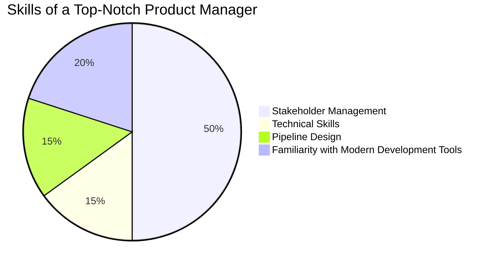

## Overview

## Technical Checklist

- [ ] cloudflare - how it works
- [ ] netlify - how it works
- [ ] mongoDB - SQL and NoSQL
- [ ] aws/lambda - how it works
- [ ] next js framework
- [ ] nest js framework
- [ ] golden crown admin panel
- [ ] github fundamental course 

## To Watch Video

 - [ ] [Introduction to Git and Github](https://youtu.be/ulQA5tjJark)
 - [ ] [Github Professional](https://youtu.be/Uszj_k0DGsg)
 - [ ] [Basecamp Introduction](https://youtu.be/rY9z7Bfimr4)
 - [ ] [Introduction to Figma](https://youtu.be/o1nCmiW6auE)
 - [ ] [ESLint](https://www.youtube.com/watch?v=ZuDIXV94Z1w)
 - [ ] [API Testing](https://youtu.be/VywxIQ2ZXw4)

## Documentations

### Product Management Skills from Wish Work Perspective

`Last Edit : 30 May` 
